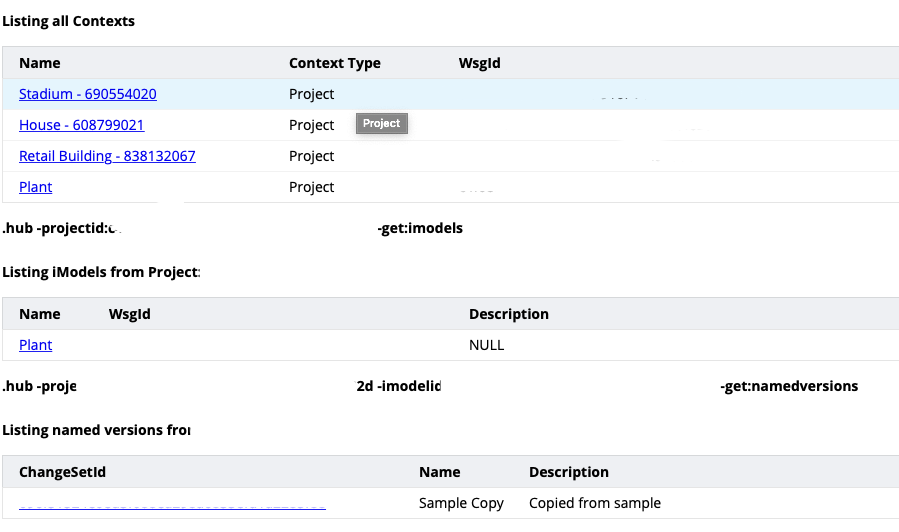

# Querying for Aspects of an Element

This section uses the [iModel Console](https://imodelconsole.bentley.com) to execute queries against the `Stadium` sample iModel.

## Open an iModel in the iModel Console

1. Go to https://imodelconsole.bentley.com
1. Select the project, then select an iModel then select a changeset
  
1. Wait until the green button in the lower right says Run
  

## Identifying the Aspects applied to an Element

There are two types of aspect, [unique and multi](https://www.itwinjs.org/bis/intro/elementaspect-fundamentals/).  They are stored in independent tables and must be queried for independently.

1. Query for aspects in the iModel

    ```SQL
    SELECT * FROM bis.ElementMultiAspect
    ```

    ```SQL
    SELECT * FROM bis.ElementUniqueAspect
    ```

    > NOTE: The base aspect classes only have one property, `Element` it is a navigation property that points to the Element that owns the Aspect

1. Query for aspects and the elements that own them

    ```SQL
    SELECT * FROM bis.ElementMultiAspect a JOIN bis.Element e ON e.ECInstanceId = a.Element.Id
    ```

1. Query for Element classes and the aspect classes applied to them

    ```SQL
    SELECT ec_classname(e.ECClassId) Element_Class, json_group_array(DISTINCT(ec_className(a.ECClassId))) Aspect_Classes FROM bis.Element e 
        JOIN bis.ElementMultiAspect a ON a.Element.Id = e.ECInstanceId
        GROUP BY e.ECClassId
    ```

    > Queries like this that look for distinct classes are helpful when trying to determine the nature of the data in an iModel.  Notice that `Generic.PhysicalObject` has the most aspect classes.

1. Query for a specific Element and its aspects.  This query uses the element selected by clicking on a glass section in the stadium.

    ```SQL
    SELECT * FROM bis.Element e JOIN bis.ElementMultiAspect a ON a.Element.Id = e.ECInstanceId WHERE e.ECInstanceId = 0x200000063de
    ```

1. Specialize query to get all properties

    ```SQL
    SELECT * FROM Generic.PhysicalObject e JOIN DgnCustomItemTypes_SS_Steel_Structure.GlassElementAspect a ON a.Element.Id = e.ECInstanceId JOIN bis.ExternalSourceAspect a2 ON a2.Element.Id = e.ECInstanceId WHERE e.ECInstanceId = 0x200000063de
    ```

    > Compare the properties selected to what is shown in Design Review.

[Next: Spatial Queries](spatial-queries.md)