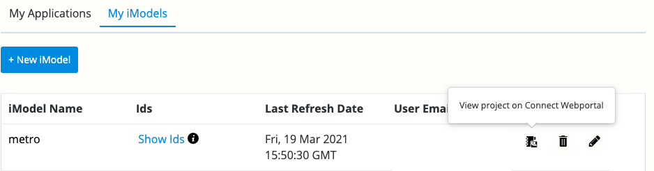
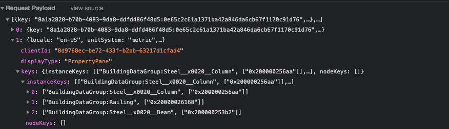
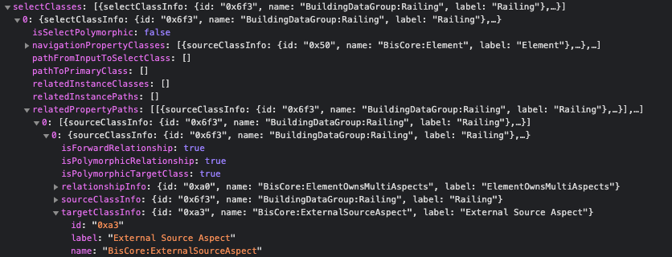
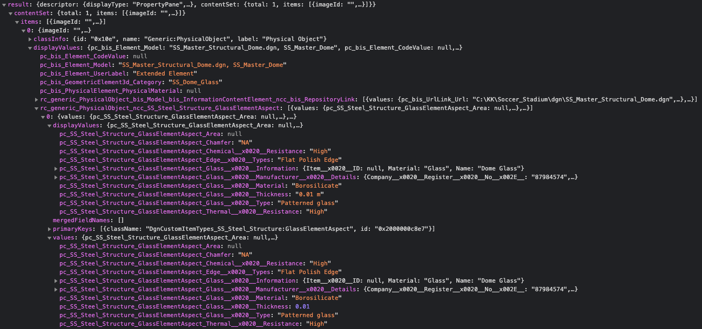
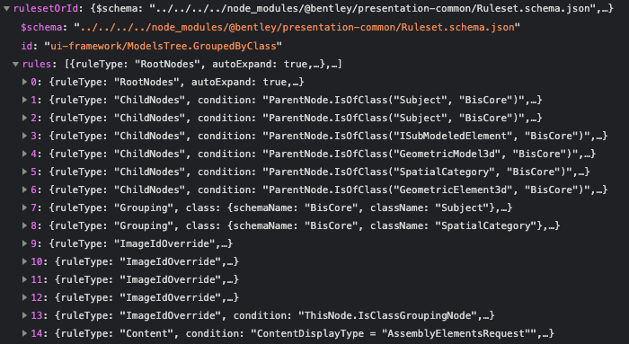

# iTwin Design Review Tips

iTwin Design Review is a great way to view an iModel and related Digital Twin data.  It is not always obvious how to write an ECSql query for what is shown in Design Review.  This section shows some tricks that can help.

## Open an iModel in iTwin Design Review

1. Start at the [registration dashboard](https://www.itwinjs.org/getting-started/registration-dashboard?tab=1)
1. Click the workbook icon to view project on connect webportal

    
1. Click on the iModel
1. Click on the view button

## Identifying selected elements

1. Open Developer tools in your browser
1. Click on something in the 2d or 3d view
1. Find the request whose URL ends with `getContentDescriptor`
1. Look in the request playload

    
    > Each Elements id is listed by the Element class.  in this example a steel column, a railing and a beam is selected.
1. Query for the elements in the iModel Console

    ```SQL
    SELECT * FROM BuildingDataGroup.Railing WHERE ECInstanceId = 0x200000063de
    ```

    > The ECInstanceId shown here is unique to this iModel, use an Element Id seen in the request body.

    > NOTE about Ids: An Element has a fixed Id within an iModel, it is a unique identifier for the lifetime of the Element.  If an Element is deleted and a new one inserted that represents the same object the will be different.  To identify an object over the Element use the code system, federation guid or some other means.

## Understand where data shown in the Property Pane comes from

1. Start with the request from the previous step
1. Look at the response payload and find the `selectedClasses` array.  This contains all the classes that were selected to build up the data shown in the property pane.  It will include the class of the Element selected, any Element Aspects attached to the Element and information about other relationships.

    
1. Query for that related object (in this case an Element Aspect that defines where this Element originally came from)

    ```SQL
    SELECT * FROM BisCore.ExternalSourceAspect WHERE Element.Id = 0x200000063de
    ```

## See the raw unformatted values for data shown in the property pane

1. Start from the `getContentDescriptor` request from the previous steps and find the related calls to `getPagedContent`.  Identify the one whose `displayType` is `PropertyPane`
1. Expand the result to see the items in the content set.  The `displayValues` object holds the formatted values and `values` holds the unformatted values.  These structures maybe nested.

    
    > NOTE: property names shown here are concatenated strings used internally by the presentation system.  This name can be used to search the content descriptor for the field definition.  
    > ALSO NOTE: The Content Descriptor can also be found in the response for getPagedContent so it can be helpful to copy out the entire response body into a text editor when examining it.

## Find the presentation rules used to build a tree

This is an advanced topic not fully covered in this talk, but presentation rules drive Design Reviews UI and is included in our [open source iModel.js code base](https://github.com/imodeljs/imodeljs) and documented on [itwinjs.org](https://www.itwinjs.org/learning/presentation/)

1. With dev tools open select any tree (for example the model tree)
1. Find the `getPagedNodes` request and expand it to find the `rulesetOrId` node.
1. The rules in the ruleset define how the tree should be built

    
1. This ruleset and many others can be found in our open source repository: https://github.com/imodeljs/imodeljs/blob/master/ui/framework/src/ui-framework/imodel-components/models-tree/Hierarchy.GroupedByClass.json
1. Other rulesets can be found by looking on other presentation calls or by searching the iModel.js source for the ruleset schema

    ```json
    "$schema": "../../../../node_modules/@bentley/presentation-common/Ruleset.schema.json",
    ```

[Next: Element Aspect Queries](aspect-queries.md)